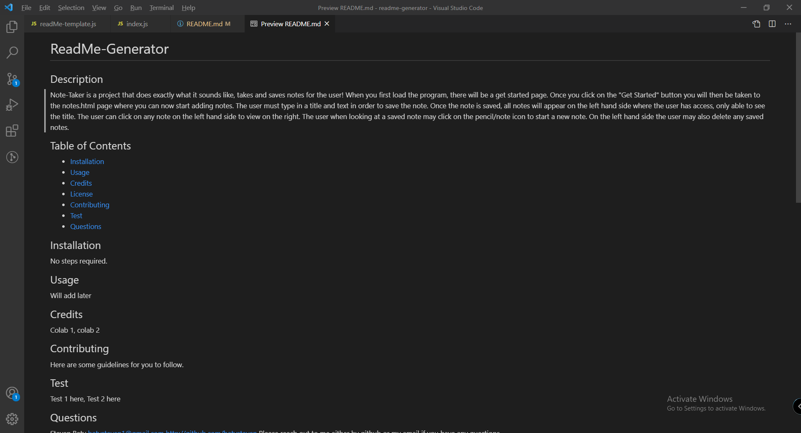

# ReadMe-Generator

## Description
Note-Taker is a project that does exactly what it sounds like, takes and saves notes for the user! When you first load the program, there will be a get started page. Once you click on the "Get Started" button you will then be taken to the notes.html page where you can now start adding notes. The user must type in a title and text in order to save the note. Once the note is saved, all notes will appear on the left hand side where the user has access, only able to see the title. The user can click on any note on the left hand side to view on the right. The user when looking at a saved note may click on the pencil/note icon to start a new note. On the left hand side the user may also delete any saved notes. 

## Table of Contents
- [ReadMe-Generator](#readme-generator)
  - [Description](#description)
  - [Table of Contents](#table-of-contents)
  - [Installation](#installation)
  - [Usage](#usage)
  - [Credits](#credits)
  - [Contributing](#contributing)
  - [Test](#test)
  - [Questions](#questions)
  - [License](#license)

## Installation
No steps required.

## Usage

## Credits
Colab 1, colab 2

## Contributing
Here are some guidelines for you to follow.

## Test
Test 1 here, Test 2 here

## Questions
Steven Baty
batysteven1@gmail.com
http://github.com/batysteven
Please reach out to me either by github or my email if you have any questions.

## License
MIT License

Copyright (c) 2021

Permission is hereby granted, free of charge, to any person obtaining a copy
of this software and associated documentation files (the "Software"), to deal
in the Software without restriction, including without limitation the rights
to use, copy, modify, merge, publish, distribute, sublicense, and/or sell
copies of the Software, and to permit persons to whom the Software is
furnished to do so, subject to the following conditions:

The above copyright notice and this permission notice shall be included in all
copies or substantial portions of the Software.

THE SOFTWARE IS PROVIDED "AS IS", WITHOUT WARRANTY OF ANY KIND, EXPRESS OR
IMPLIED, INCLUDING BUT NOT LIMITED TO THE WARRANTIES OF MERCHANTABILITY,
FITNESS FOR A PARTICULAR PURPOSE AND NONINFRINGEMENT. IN NO EVENT SHALL THE
AUTHORS OR COPYRIGHT HOLDERS BE LIABLE FOR ANY CLAIM, DAMAGES OR OTHER
LIABILITY, WHETHER IN AN ACTION OF CONTRACT, TORT OR OTHERWISE, ARISING FROM,
OUT OF OR IN CONNECTION WITH THE SOFTWARE OR THE USE OR OTHER DEALINGS IN THE
SOFTWARE..

http://github.com/batysteven
[GitHub](http://github.com/batysteven)
